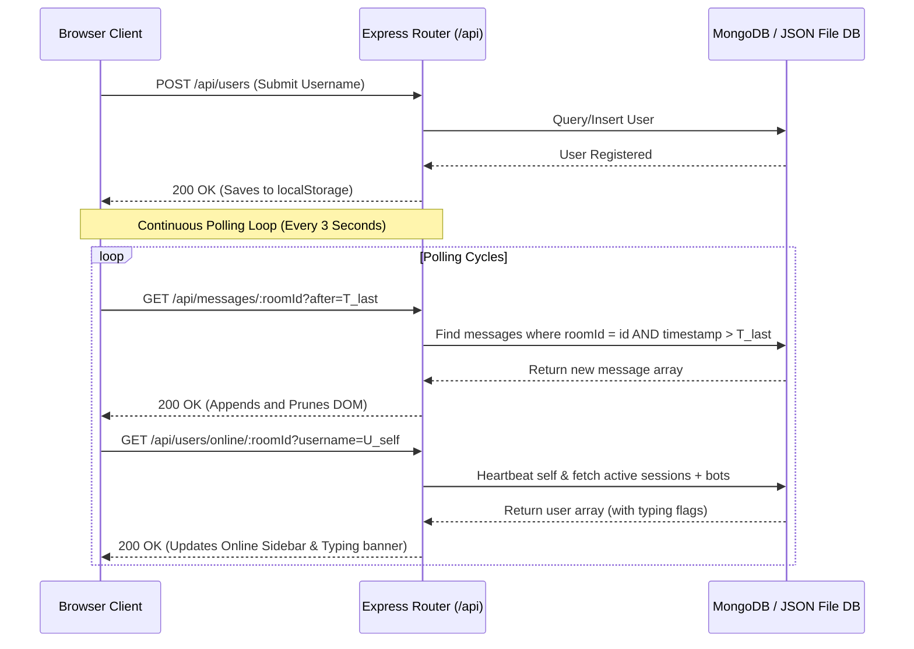

# 💬 Multi-room Chat Hub

[](https://nodejs.org/)
[](https://www.mongodb.com/)
[](https://expressjs.com/)
[](https://opensource.org/licenses/MIT)

> A modern, glassmorphic multi-room chat dashboard simulating real-time interactions using continuous HTTP polling, built entirely without WebSockets.

---

## 📖 Table of Contents
1. [Project Overview](#-project-overview)
2. [Key Features](#-key-features)
3. [Tech Stack](#-tech-stack)
4. [Architecture & Flow](#-architecture--flow)
5. [Folder Structure](#-folder-structure)
6. [Installation & Setup](#-installation--setup)
7. [API Documentation](#-api-documentation)
8. [Database Schema](#-database-schema)
9. [Polling Mechanism Analysis](#-polling-mechanism-analysis)
10. [Application Workflow](#-application-workflow)
11. [Screenshots](#-screenshots)
12. [QA & Testing Strategy](#-qa--testing-strategy)
13. [Future Enhancements](#-future-enhancements)
14. [Troubleshooting](#-troubleshooting)
15. [Contributing](#-contributing)
16. [License](#-license)

---

## 🔍 Project Overview

The **Multi-room Chat Hub** is a functional chat workspace designed to demonstrate real-time data synchronization using stateless **HTTP long/short polling**. 

### The Purpose
In enterprise setups, stateful protocols like WebSockets (`ws://`) can be blocked by restrictive corporate firewalls, proxies, or load balancers, and require complex server configurations to manage thousands of open TCP connections. This project showcases how an optimized **REST API with 3-second Fetch polling** can deliver a near real-time, responsive multi-user chat experience that is easy to scale, secure, and monitor using standard HTTP infrastructures.

---

## ✨ Key Features

- **Multi-room Navigation**: Toggle between default rooms (*#General*, *#Technology*, *#Gaming*, *#Sports*) or create custom rooms instantly.
- **Optimized Polling Feed**: Uses a client-side cursor query (`?after=<timestamp>`) to poll *only* new messages, reducing payload sizes to near-zero when rooms are idle.
- **Dual-Database Adapter (Self-Healing)**: Connects to MongoDB via Mongoose. If MongoDB is offline, it automatically falls back to reading/writing local JSON databases (`backend/data/*.json`) within 2 seconds.
- **Dynamic Port Selection**: Gracefully captures `EADDRINUSE` port conflicts. If port `5000` is bound by another service, the backend increments and listens on the next free port (`5001`, `5002`, etc.) automatically.
- **Client Port Auto-Probing**: If the frontend is previewed from a separate server (e.g. VS Code Live Server on port `5500`), the client scans ports `5000` to `5003` to discover and connect to the active backend automatically.
- **XSS & Injection Protection**: Escapes all username, bio, room, and message inputs before insertion into the DOM.
- **Smart Scroll Alignment**: Feeds scroll to the bottom only if the user is already looking at the bottom, letting them read older chat history uninterrupted.
- **Bot Chatter Simulator**: A background routine automatically posts mock chat messages from bots every 20 seconds, showing live updates on other screens.
- **Online Typing Simulation**: Captures online listings and dynamically displays typing indicators (`"CodeNinja is typing..."`) using the 3-second poll.
- **Premium Themes**: Smooth transitions between a futuristic glowing Dark Mode and a warm Indigo Light Mode.

---

## 💻 Tech Stack

### Frontend
- **HTML5**: Semantic layout elements (`<header>`, `<main>`, `<aside>`).
- **CSS3 (Vanilla)**: Glassmorphic styling, flex/grid systems, and custom media queries.
- **JavaScript (ES6+)**: Fetch API, dynamic state management, and async polling loops.

### Backend
- **Node.js**: Asynchronous event-driven JavaScript runtime.
- **Express.js**: REST API routing, static asset serving, and server error capturing.

### Database
- **MongoDB / Mongoose**: ODM schemas and database persistence.
- **File System (Fallback)**: Node `fs` JSON adapter representing a queryable local database.

### Dev Tools
- **Nodemon**: File monitoring for hot-reloads.
- **FontAwesome**: High-quality UI icons.
- **Outfit & Plus Jakarta Sans**: Elegant Google Fonts.

---

## 📐 Architecture & Flow

The application serves static frontend files directly from the Express backend, running as a single cohesive unit:



---

## 📁 Folder Structure

```
Multi-room-Chat-Hub/
├── frontend/
│   ├── index.html        # App dashboard layout & login modal overlays
│   ├── style.css         # Glassmorphism styling, CSS vars, responsive rules
│   └── script.js         # Port discovery, state manager, and polling loops
│
├── backend/
│   ├── config/
│   │   └── db.js         # Mongoose connection & JSON storage fallback logic
│   ├── controllers/
│   │   ├── userController.js    # Login actions & simulated heartbeat list
│   │   ├── roomController.js    # Rooms retrieval & room creation
│   │   └── messageController.js # Message feeds, polling, and text search
│   ├── models/
│   │   ├── User.js       # Dynamic model proxies (preserves Mongoose 'this')
│   │   ├── Room.js
│   │   └── Message.js
│   ├── routes/
│   │   ├── userRoutes.js
│   │   ├── roomRoutes.js
│   │   └── messageRoutes.js
│   └── server.js         # Midlleware mappings & mock bot intervals
│
├── .env                  # Port & MongoDB credentials
├── package.json          # Node packages & scripts
└── README.md             # Documentation
```

---

## 🚀 Installation & Setup

### 1. Clone the Repository
```bash
git clone https://github.com/your-username/multi-room-chat-hub.git
cd multi-room-chat-hub
```

### 2. Install Dependencies
```bash
npm install
```

### 3. Configure the Environment
Create a `.env` file in the root directory:
```env
PORT=5000
MONGODB_URI=mongodb://127.0.0.1:27017/chat-hub
DB_MODE=auto # Use 'auto' to auto-detect MongoDB, 'json' to force file storage
```

### 4. Run the Backend
To start the server:

#### For Production:
```bash
npm start
```
#### For Development:
```bash
npm run dev
```
*The server will boot and log: `Server is running on: http://localhost:5000` (or a fallback port).*

### 5. Access the Frontend
Open your browser and navigate to the address logged in the terminal (e.g. **[http://localhost:5000](http://localhost:5000)**).

If you are using a static development server (such as VS Code Live Server on port `5500`), simply open the page there. The client's built-in **port prober** will automatically find the active backend and connect to it.

---

## 📡 API Documentation

### 👤 Users Section

#### `POST /api/users`
Logs in or registers a username.
- **Request Body**:
  ```json
  { "username": "GamerX" }
  ```
- **Response (`200 OK`)**:
  ```json
  {
    "message": "User authenticated successfully",
    "user": {
      "id": "6a3c14b3ecb7bca4026c6f36",
      "username": "GamerX"
    }
  }
  ```

#### `GET /api/users/online/:roomId`
Retrieves currently active users and simulated bots.
- **Request Query**: `?username=GamerX` (sends a heartbeat update)
- **Response (`200 OK`)**:
  ```json
  [
    { "username": "GamerX", "status": "online", "bio": "Active User" },
    { "username": "CodeNinja", "status": "online", "bio": "Coffee into code.", "typing": true }
  ]
  ```

---

### 💬 Rooms Section

#### `GET /api/rooms`
Retrieves all rooms and their respective message counts.
- **Response (`200 OK`)**:
  ```json
  [
    {
      "_id": "6a3c14b3ecb7bca4026c6f3a",
      "roomName": "General",
      "description": "General chit-chat",
      "messageCount": 42
    }
  ]
  ```

#### `POST /api/rooms`
Creates a new chat channel.
- **Request Body**:
  ```json
  {
    "roomName": "Design",
    "description": "UI/UX talks"
  }
  ```
- **Response (`201 Created`)**:
  ```json
  {
    "message": "Room created successfully",
    "room": {
      "_id": "6a3c14b3ecb7bca4026c6ffe",
      "roomName": "Design",
      "description": "UI/UX talks"
    }
  }
  ```

---

### ✉️ Messages Section

#### `GET /api/messages/:roomId`
Fetches room history, matching polling and search criteria.
- **Request Query Parameters**:
  - `after`: ISO string (only retrieve messages newer than this date)
  - `search`: string (search keywords)
- **Response (`200 OK`)**:
  ```json
  [
    {
      "_id": "667a421a1b1bca3a1bcde45f",
      "roomId": "6a3c14b3ecb7bca4026c6f3a",
      "username": "CodeNinja",
      "message": "I love dynamic layouts!",
      "timestamp": "2026-06-24T17:32:35.256Z"
    }
  ]
  ```

#### `POST /api/messages`
Posts a new message.
- **Request Body**:
  ```json
  {
    "roomId": "6a3c14b3ecb7bca4026c6f3a",
    "username": "GamerX",
    "message": "Good game, well played!"
  }
  ```
- **Response (`201 Created`)**:
  ```json
  {
    "_id": "667a425b1b1bca3a1bcde46d",
    "roomId": "6a3c14b3ecb7bca4026c6f3a",
    "username": "GamerX",
    "message": "Good game, well played!",
    "timestamp": "2026-06-24T17:34:02.122Z"
  }
  ```

---

## 🗄️ Database Schema

```
┌─────────────────────────────────┐      ┌─────────────────────────────────┐
│              User               │      │              Room               │
├─────────────────────────────────┤      ├─────────────────────────────────┤
│ _id: ObjectId [PK]              │      │ _id: ObjectId [PK]              │
│ username: String (Unique)       │      │ roomName: String (Unique)       │
│ createdAt: Date                 │      │ description: String             │
└─────────────────────────────────┘      │ createdAt: Date                 │
                                         └─────────────────────────────────┘
                  ┌─────────────────────────────────┐
                  │             Message             │
                  ├─────────────────────────────────┤
                  │ _id: ObjectId [PK]              │
                  │ roomId: String (Ref: Room._id)  │
                  │ username: String                │
                  │ message: String                 │
                  │ timestamp: Date                 │
                  └─────────────────────────────────┘
```

---

## ⏱️ Polling Mechanism Analysis

Continuous polling is implemented on a **3-second interval** using client-side `setInterval` loops. 

### Implementation Details
- **Timestamp Cursors**: The client stores the timestamp of the last message rendered. Subsequent API requests pass this timestamp via `?after=`. The database filters queries using `$gt` (greater than) indices.
- **Bandwidth Efficiency**: When a room has no new activity, the network transit payload is reduced to an empty array `[]` (under 120 bytes), minimizing network overhead.
- **Deduplication Set**: Message IDs are registered in a JavaScript `Set`. If any message has already been rendered, it is filtered out on arrival.

### Advantages & Limitations
- **Advantages**: Completely stateless. Servers do not need to maintain open persistent TCP sockets, making load-balancing extremely easy using standard HTTP gateways.
- **Limitations**: Up to 3 seconds of delay (latency) before seeing another user's message. Also generates more HTTP requests than WebSockets during idle periods.

---

## 🔄 Application Workflow

```
┌──────────────┐     ┌──────────────┐     ┌──────────────┐
│  Enter Name  ├───>│ Select Room  ├───>│ Chat Feed    │
│  (Validate)  │     │ (Load List)  │     │ (Polls 3s)   │
└──────────────┘     └──────────────┘     └──────┬───────┘
                                                 │
                                                 ▼
┌──────────────┐     ┌──────────────┐     ┌──────┴───────┐
│ Toggle Theme │<───┤ Create Room  │<───┤ Send Msg     │
│ (Light/Dark) │     │ (Add Custom) │     │ (Auto-scroll)│
└──────────────┘     └──────────────┘     └──────────────┘
```

---

## 🖼️ Screenshots

- **Login Screen**: Minimalist glassmorphic card with inputs.
- **Chat Dashboard**: Double-sidebar layout with neon glow panels.
- **Room List**: Responsive navigation listing channels and counts.
- **Messaging Area**: Clean message bubbles with bot badges.
- **Mobile View**: Collapsed drawer menu.

---

## 🧪 QA & Testing Strategy

1. **Security Checks**: Validate that empty inputs, long strings (>1000 characters), and XSS scripts (`<script>alert(1)</script>`) are escaped on the frontend and rejected by backend controllers.
2. **Dynamic Port Test**: Start an application on port `5000`. Launch the backend and confirm that the terminal warns of port occupancy and binds to `5001` or `5002` automatically.
3. **Database Fallback Test**: Disable local MongoDB daemon and run the server. Verify that local JSON storage directories are initialized and read/write operations work.
4. **Concurrency Audit**: Open two different browser tabs under separate accounts. Confirm that message exchanges appear on both feeds within the 3-second polling window.

---

## 🔮 Future Enhancements

- **Upgrade to WebSockets**: Implement Socket.io as a primary channel, keeping Fetch polling as a fallback.
- **JWT Authentication**: Add passwords, hash encryption, and JSON Web Tokens.
- **Custom User Avatars**: Allow uploading profile pictures.
- **Rich Media**: Add support for images, video attachments, emojis, and reactions.
- **Message Read Indicators**: Show double-check ticks for read messages.

---

## 🛠️ Troubleshooting

- **EADDRINUSE (Port occupied)**: Terminate the other process or let our server dynamically bind to the next available port.
- **MongoDB Offline Warnings**: Normal fallback behavior. Mongoose times out in 2 seconds and starts local JSON file storage.
- **CORS blockages**: Make sure `app.use(cors())` is placed before routes inside `backend/server.js`.
- **Chat Overlay Lock**: If you cannot click elements after login, clear local storage (`localStorage.clear()`) and reload the page to initialize the self-healing layout.

---

## 🤝 Contributing
1. Fork the project.
2. Create your Feature Branch (`git checkout -b feature/AmazingFeature`).
3. Commit your changes (`git commit -m 'Add some AmazingFeature'`).
4. Push to the Branch (`git push origin feature/AmazingFeature`).
5. Open a Pull Request.

---

## 📄 License
This project is licensed under the MIT License - see the LICENSE file for details.

---
